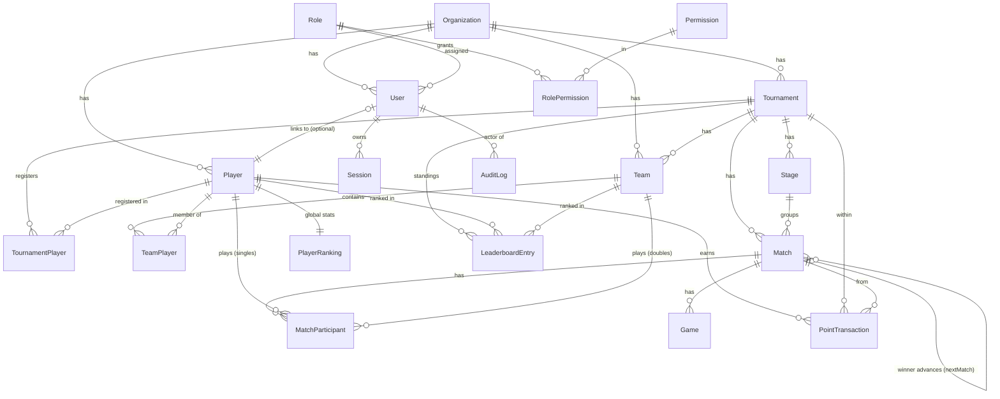

# Database

PostgreSQL, normalized, UUID primary keys, `createdAt`/`updatedAt` timestamps,
soft-delete (`deletedAt`) on user-facing aggregates, and indexes on all common
filters and foreign keys. Canonical definition: [`prisma/schema.prisma`](../prisma/schema.prisma).

## ERD

## Tables

| Table | Purpose | Notable constraints / indexes |
| --- | --- | --- |
| `Organization` | Club / tenant | unique `slug` |
| `Role` | Role (ADMIN/ORGANIZER/PLAYER…) | unique `name` |
| `Permission` | Fine-grained permission | unique `key` |
| `RolePermission` | Role↔Permission join | unique `(roleId, permissionId)` |
| `User` | Login identity | unique `email`, unique `phone`, unique `playerId`; `passwordHash` (scrypt); FK `roleId` |
| `Session` | Revocable session | unique `tokenHash`; idx `userId`, `expiresAt` |
| `Player` | Player record | idx `organizationId`, `fullName`, `deletedAt` |
| `PlayerRanking` | Materialized global stats | unique `playerId`; idx `totalPoints`, `rank` |
| `Tournament` | Event | idx `status`, `organizationId`; FKs `organizerId`, `createdById` |
| `TournamentPlayer` | Eligibility | unique `(tournamentId, playerId)` |
| `Team` | Doubles/mixed team | idx `tournamentId` |
| `TeamPlayer` | Team↔Player | unique `(teamId, playerId)` (no dup player) |
| `Stage` | Ordered stage | unique `(tournamentId, order)` |
| `Match` | Match | `version` (optimistic lock); `nextMatchId`/`nextMatchSlot` (bracket); idx `tournamentId`, `stageId`, `status`, `scheduledAt` |
| `MatchParticipant` | Side A/B (player or team) | unique `(matchId, side)` |
| `Game` | Per-game score | unique `(matchId, gameNumber)` |
| `PointTransaction` | Append-only points ledger | idx `playerId`, `tournamentId`, `matchId`, `createdAt` |
| `LeaderboardEntry` | Per-tournament standing | unique `(tournamentId, playerId)` & `(tournamentId, teamId)` |
| `AuditLog` | Change history | idx `(entityType, entityId)`, `actorUserId`, `createdAt` |

## Design decisions

- **Enum-like columns are `String`** validated in the app (Zod + TS unions), so
  new stage types / formats / roles need no destructive migration.
- **Ledger is the source of truth**; `PlayerRanking` and `LeaderboardEntry` are
  rebuildable caches.
- **Bracket** modeled with a self-relation on `Match` (`nextMatchId` +
  `nextMatchSlot`) so winners advance deterministically.
- **Auditability** via immutable `AuditLog` rows with before/after JSON.
